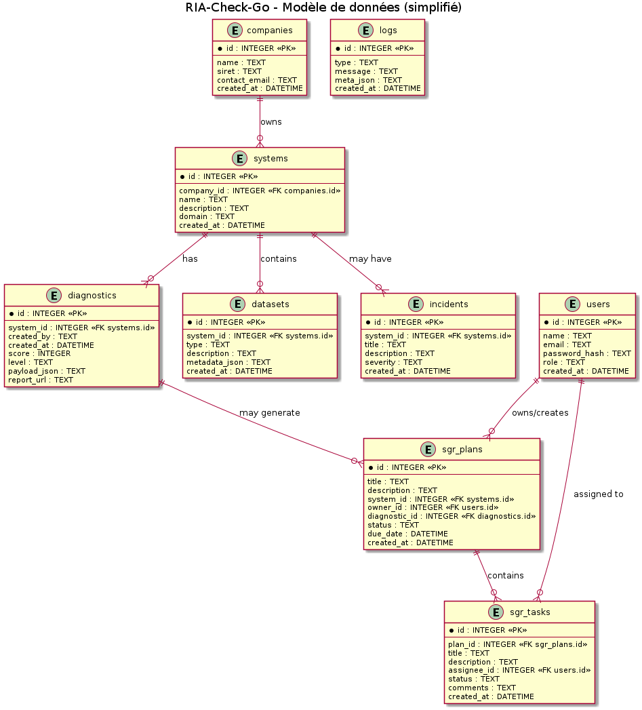

# RIA Check & Go — Prototype

Prototype statique illustrant le cahier des charges pour une application d'aide à la mise en conformité RIA.

Fichiers principaux:

- `index.html` : page principale avec le questionnaire interactif, la génération PDF et le formulaire de contact.
- `assets/` : styles et script JavaScript.
- `docs/technical.md` : documentation technique (architecture, modèle de données, stratégie de tests).
- `docs/mockups.html` : maquettes/wireframes des 3 écrans principaux.

Pour lancer localement (simple):

Ouvrir `index.html` dans un navigateur ou démarrer un serveur local (recommandé) :

```bash
# Servir le dossier courant sur le port 8000 (Python 3)
python3 -m http.server 8000
# puis ouvrir http://localhost:8000
```

Notes:
- Ce prototype est indicatif et ne couvre pas l'ensemble des exigences réglementaires. Il montre la logique de classification, la génération d'un PDF et la structure documentaire attendue.

Backend minimal (optionnel)
---------------------------
Un backend minimal (Express + SQLite) a été ajouté pour persister diagnostics, datasets, contacts, logs et incidents. Pour l'utiliser :

```bash
# installer les dépendances (node.js requis)
npm install
# lancer le serveur (écoute sur le port 3000 par défaut)
npm start
# ouvrir http://localhost:3000
```

Les endpoints importants:
- `POST /api/v1/diagnostics` — enregistrer un diagnostic (json: {system,answers,result,created_by})
- `GET /api/v1/diagnostics/:id` — récupérer diagnostic
- `POST /api/v1/contact` — soumettre une demande de devis
- `POST /api/v1/datasets` — enregistrer métadonnées dataset
- `POST /api/v1/register` — soumettre une requête d'enregistrement (stub)

Architecture & diagramme
------------------------

Le modèle de données et les principales entités sont schématisés dans `docs/diagram_plantuml.puml`.

Preview du diagramme :



Vous trouverez aussi une version vectorielle : `docs/diagram_plantuml.svg` et le source PlantUML : `docs/diagram_plantuml.puml`.

Authentification et dashboard admin
---------------------------------
Le backend propose un système d'authentification basique (sessions) pour accéder à un dashboard minimal :

- `POST /api/v1/signup` — créer un utilisateur (json: {name,email,password,role})
- `POST /api/v1/login` — se connecter (json: {email,password})
- `POST /api/v1/logout` — se déconnecter
- `GET /api/v1/session` — vérifier session courante

Page dashboard (UI minimal) : `http://localhost:3000/dashboard` (login puis affichage des diagnostics, incidents et logs).


Fonctionnalité : génération serveur de la Documentation Technique (Annexe IV)
--------------------------------------------------------------------
Une route permet de générer côté serveur un PDF de Documentation Technique (Annexe IV) à partir d'un diagnostic enregistré :

- `POST /api/v1/diagnostics/:id/generate-dt` — génère un PDF et renvoie `{ok:true, url:'/uploads/reports/<file.pdf>'}`.

Le PDF est stocké dans `uploads/reports/` et servi statiquement via `/uploads/reports/<file>`.


